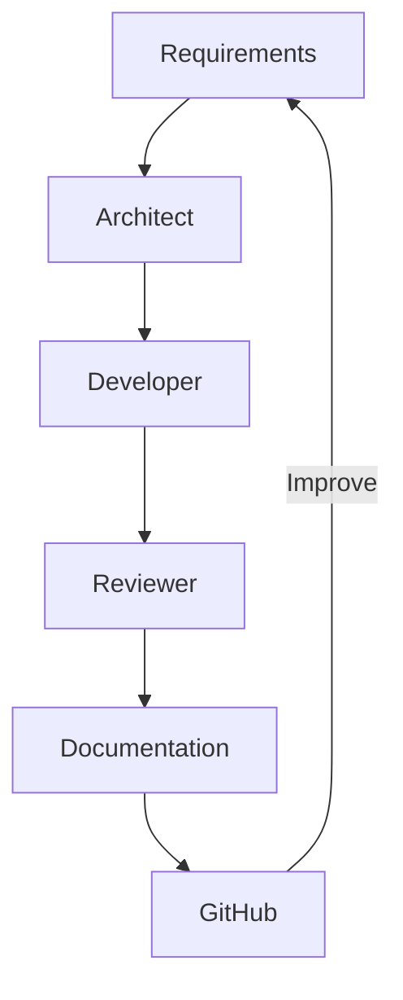

# AI Workflows

I use a number of models with different configurations across both the server, and my main PC to make optimal use of resources. Each of the models also have a specialist role to make the most of their training data for increased code quality, and improved overall architecture.

## Diagram 

## Model Responsibilities

| Role       | Model              | Purpose               |
| ---------- | ------------------ | --------------------- |
| Architect  | Qwen 3 14B         | Design and planning   |
| Heavy Developer  | Qwen 2.5 Coder 14B | High intensity implementation        |
| Light Developer  | Qwen 2.5 Coder     | Low intensity implementation        |
| Reviewer   | DeepSeek R1 14B    | Critique and analysis |
| Documenter | Llama 3.2          | Documentation         |

## Development workflow

### Step 1 - Architect

The architect uses Qwen 3: 14b and runs on my main PC. This ensures high level reasoning for improved architectures. This is where initial discussion on new features occurs. Once I have decided on an architecture I think will be best. I can begin to look at how I would implement it as code roughly. At this point I can pass the instructions to the developers.

### Step 2 - Developer

There are 2 developers that I have available to use. Both have the job of implementing code as instructed. The light developer is there for repetitive tasks and small functions or procedures. The heavy developer is tasked with higher intensity classes or functions. This ensures I make the most of resources and distribute the usage effectively. Given that the Qwen 2.5 coder: 14b is trained for programming, this is its ideal task.

### Step 3 - Reviewer

The reviewer does exactly as described, it reviews implemented code. This means identifying edge cases, creating tests, and criticises code. As a result I can create more robust code.

### Step 4 - Documenter

The documenter works to ensure I or anyone else who is trying to understand the code has a detailed development log that tracks the architecture, design decisions, and other important parts of the design or code. It can also be useful for making quick updates to README files when changes are made or new features are added. This is mostly done by llama 3.2 on the server because it is not a very intensive task and it isn't time sensitive so leaving the server to write them is ideal for saving me time and effort.

This process can then be repeated to add new features, improve code, optimise, and tweak design. 

## Project Isolation

To make management of conversations easy, I can set up different projects and chats using Open WebUI so that each of my projects can have a number of dedicated chats. Each chat has memory so I can follow on from where I left off as well as access to the project files which means decisions by the models are well informed and accurate. Some of the general chats most projects have could be:
- Requirements
- Architecture
- Roadmap
- Research
- Dev logs

## Roo Code Integration

For easy use of the models while I use VS Code, I use the Roo Code plugin which allowed me to quickly and easily configure each model with its profile. Profiles mean that I can customise the behaviour of the agent generally or on a project specific basis. This means that I can quickly consult or asign tasks to a model while developing a new feature. Roo Code's integration with VS Code also means that working with git and github is much easier. Roo Code is however designed to work with claude mostly but I haven't yet found any integration issues for the Ollama models.

## Benefits, Pitfalls, and Possible Improvements

### Benefits

- No API Costs
- Data remains local and secure
- Works offline
- Project-specific workflows
- Complete model customisation
- Unlimited token usage
- No chronological usage quotas

### Drawbacks

- Hardware limitations
- Longer processing times
- Longer response times
- Limited to open source models
- Non-perfect integration

### Possible Improvements

- Upgrade PC hardware
- Upgrade server hardware
- Configure server to be accessable publicly but securely
- Run multiple servers in parallel
- Create a full chat and development integration
