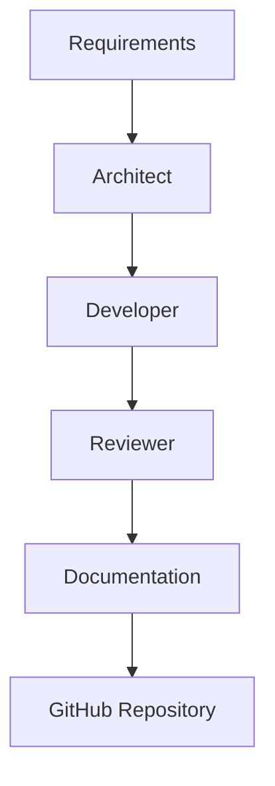

# AI Workflows

This project implements a multi-agent AI development workflow using locally hosted LLMs. The system distributes software engineering tasks across specialised models for optimised performance, accurage, and resource usage across multiple machines.

The workflow is designed as a closed-loop development cycle spanning requirements, design, implementation, review, and documentation.

## Workflow Diagram 

This diagram represents an iterative development loop where each iteration is aimed at maximising quality of the product.

## Model Responsibilities

| Role | Model | Purpose |
| ---------- | ------------------ | --------------------- |
| Architect | Qwen 3 14B | Systems design, planning, and architectural suggestions |
| Heavy Developer | Qwen 2.5 Coder 14B | High-complexity implementation tasks |
| Light Developer | Qwen 2.5 Coder | Low-complexity simple functions and repetitive development tasks |
| Reviewer | DeepSeek R1 14B | Code review, debugging, and analysis |
| Documenter | Llama 3.2 | Documentation and knowledge capture |

## Development workflow

### Phase 1 - Architect

The Architect model `Qwen 3 14B` is used to define system structure, suggest design decisions, and high-level implementation strategies. This phase focuses on reasoning and planning before code is written.

### Phase 2 - Developer

Two developer models are used depending on the complexity of the task:
- The Heavy Developer `Qwen 2.5 Coder 14B` handles complex features, system components, and architecture critical implementation.
- The Light Developer `Qwen 2.5 Coder 7B` is used for smaller functions, repetitive tasks, and low-complexity changes.

This separation allows efficient use of compute resources while maintaining code quality.

### Phase 3 - Reviewer

The Reviewer model `Deepseek R1 14B` evaluates implemented code for logical correctness, edge cases, performance issues, and structural improvements. This stage improves reliability and reduces logical errors before integration.

### Phase 4 - Documenter

The Documenter `Llama 3.2 7B` maintains system documentation, development logs, and updates to project structure. This ensures that design decisions and implementation details remain traceable across iterations. 

## Project Isolation

Each project is managed using separate conversation environments within Open WebUI.

Each project typically includes dedicated contexts such as:
- Requirements
- Architecture
- Roadmap
- Research
- Development logs

This separation ensures contextual accuracy and prevents cross-project contamination of model memory.

## Roo Code Integration

Roo Code is used within VS Code to integrate local and remote Ollama models directly into the development workflow.

It enables model-specific tasks assignment within the editor, allowing structured interaction with:
- Planning tasks
- Code generation
- Debugging workflows
- Code review cycles

This integration also streamlines interaction with Git and GitHub workflows during development.

## Benefits, Limitations, and Possible Improvements

### Benefits

- No external API dependencies
- Data remains local and secure
- Works offline
- Project-specific workflows
- Complete model customisation
- Unlimited usage without token restrictions

### Drawbacks

- Hardware limitations
- Longer inference latency than cloud models
- Limited to open source models
- Manual configuration overhead

### Possible Improvements

- Upgrade server hardware for larger model support
- Upgrade workstation hardware for larger model support
- Improve model routing automation between roles
- Expand to multi-node distributed inference capabilities
- Develop tighter IDE-native workflow integration

## Summary

This system implements a structured multi-agent AI software development pipeline using locally hosted LLMs. It enables distributed reasoning, implementation, and review across specialised AI roles, forming a complete self-hosted engineering workflow integrated directly into the development environment.
