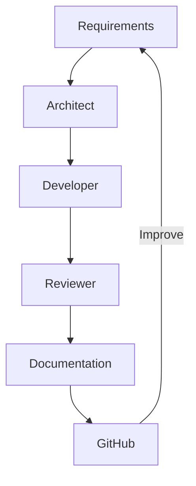

# AI Workflows

I use a number of models with different configurations across both the server, and my main PC to make optimal use of resources. Each of the models also have a specialist role to make the most of their training data for increased code quality, and improved overall architecture.

## Diagram 

## Model Responsibilities

| Role       | Model              | Purpose               |
| ---------- | ------------------ | --------------------- |
| Architect  | Qwen 3 14B         | Design and planning   |
| Heavy Developer  | Qwen 2.5 Coder 14B | High intensity implementation        |
| Light Developer  | Qwen 2.5 Coder     | Low intensity implementation        |
| Reviewer   | DeepSeek R1 14B    | Critique and analysis |
| Documenter | Llama 3.2          | Documentation         |

## Development workflow

### Step 1 - Architect

The architect uses Qwen 3: 14b and runs on my main PC. This ensures high level reasoning for improved architectures. This is where initial discussion on new features occurs. Once I have decided on an architecture I think will be best. I can begin to look at how I would implement it as code roughly. At this point I can pass the instructions to the developers.

### Step 2 - Developer

There are 2 developers that I have available to use. Both have the job of implementing code as instructed. The light developer is there for repetitive tasks and small functions or procedures. The heavy developer is tasked with higher intensity classes or functions. This ensures I make the most of resources and distribute the usage effectively. Given that the Qwen 2.5 coder: 14b is trained for programming, this is its ideal task.

### Step 3 - Reviewer

The reviewer does exactly as described, it reviews implemented code. This means identifying edge cases, creating tests, and criticises code. As a result I can create more robust code.
