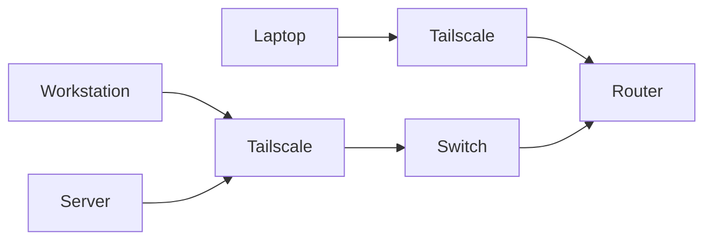

# Network Architecture

This project uses a secure private network to connect the server, development workstation, and additional devices used for administration and development. The architecture is designed to support distributed AI workloads while maintaining secure access to locally hosted services.

The network enables communication between lightweight models hosted on the server and higher-performance models hosted on the development workstation, allowing workloads to be distributed according to available hardware resources.

## Design Principles

The network was designed around the following objectives:
- Secure private communication between devices
- No public exposure of hosted services
- Reliable remote administration capabilities
- Distributed AI workload support
- Scalability for future expansion
- Simple service discovery and management

## Network Topology

## Network Components

| Component | Purpose |
|------------|---------|
| Server | Hosts AI infrastructure and lightweight models |
| Development Workstation | Primary development environment and high-performance model host |
| Laptop | Secondary development and administration device |
| Router | Local network connectivity and IP reservation |
| Network Switch | High-speed wired connectivity between core devices |
| Tailscale | Secure private networking between devices |

## Addressing

### Local Network

The server uses a reserved IP address assigned through the router. This ensures that the server remains consistently accessible and simplifies service management and device identification.

### Tailscale Network

Tailscale provides each authorised device with a private network address, typically in the format `100.x.x.x`. These addresses enable secure communication between devices regardless of their physical location while maintaining a consistent method of accessing services.

## Service Architecture

The following services are hosted on the server and accessed through the private network:

| Service | Port | Purpose |
|----------|------|---------|
| SSH | 22 | Remote administration |
| Ollama | 11434 | Local LLM API |
| Open WebUI | 3000 | Browser-based AI interface |

Access to these services is restricted to authorised devices connected to the network.

## Security Architecture

Security is implemented through multiple layers to protect both the infrastructure and hosted services.

### SSH Authentication

SSH key authentication is used for remote administration of the server. This removes reliance on password-only authentication and provides a more secure method for managing the system remotely.

Additional details can be found in:
- [docs/security/ssh-keys.md](../docs/security/ssh-keys.md)

### Firewall Controls

The server uses UFW (Uncomplicated Firewall) to restrict access to only the services required for operation. Unnecessary ports remain closed, reducing the system's attack surface.

Additional details can be found in:
- [docs/security/firewall.md](../docs/security/firewall.md)

### Tailscale Private Networking

Tailscale provides encrypted device-to-device communication using a private mesh network. This removes the need for public service exposure and traditional port forwarding while allowing secure access from authorised devices.

Additional details can be found in:
- [docs/security/tailscale.md](../docs/security/tailscale.md)

## Service Access

Services hosted on the server are accessed using the device's Tailscale address combined with the appropriate service port.

For example:
- SSH &rarr; `100.x.x.x:22`
- Ollama &rarr; `100.x.x.x:11434`
- Open WebUi &rarr; `100.x.x.x:3000`

This approach ensures that administration tools, AI models, and web interfaces remain accessible while being protected by the private network architecture.

## Summary

The network architecture combines private networking, encrypted communication, firewall controls, and secure authentication to create a reliable platform for self-hosted AI development.

The design supports distributed AI workloads across multiple devices while maintaining secure access to infrastructure and services without exposing them to the public internet.

## Related Documentation
- `docs/architecture/system-overview.md`
- `docs/architecture/ai-workflows.md`
- `docs/security/`
- `docs/setup-guides/`
