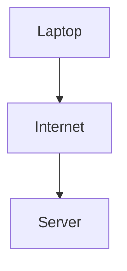
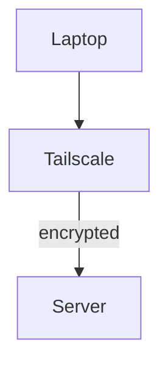

# Tailscale VPN

Tailscale allows me to created local, private, encrypted connections between the devices in the network. By installing tailscale on each device then verifying them with the network, I was able to quickly establish a very secure local private network. Once authenticated each device was assigned a  `100.x.x.x`  IP which makes identifying the devices easier. By using the tailscale dashboard I could then use the private IP to secure all the services that would need to be accessed on the server. 

This moved the communication from:

Over to:

## Benefits

- No port forwarding
- End-to-End encryption
- Simple multi-device access
- Secure access across services
