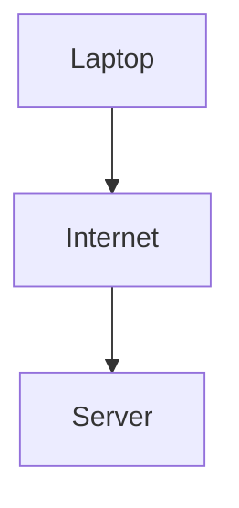
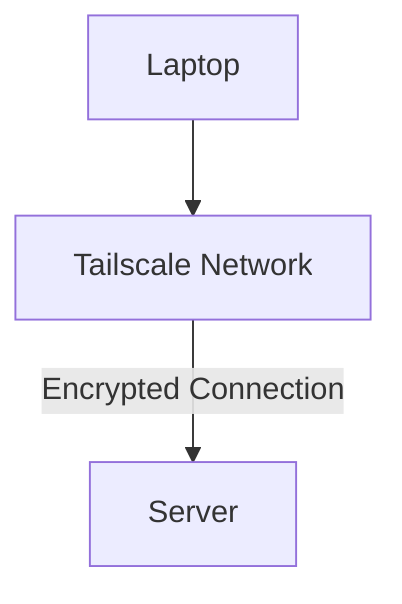

# Tailscale VPN

Tailscale creates a secure private network between trusted devices using WireGuard encryption. By installing Tailscale on each device and authenticating them to the same network, each device is assigned a private `100.x.x.x` IP address, allowing them to communicate securely regardless of their physical location.

Tailscale can be used to securely access services hosted on the local AI server without exposing them directly to the internet. This allowed applications such as Open WebUI, Ollama and SSH to be accessed through the private network while remaining isolated from public traffic.

This moved the communication from:

To:

## Benefits

- No port forwarding required.
- End-to-end encrypted connections between devices.
- Simple access to services from any trusted device.
- Reduces the server's exposure to the public internet.
- Easy management of devices through a central dashboard.
